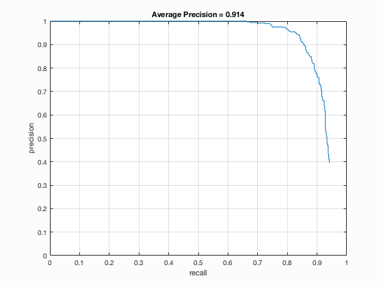

# 呂志娟 <span style="color:red">(102061152)</span>

#Project 4 / Face Detection with a Sliding Window

## Overview

In this project, I implement a face detector in Matlab, which use a learning method of SVM to classify the face and non face scene. The training data are those from [Caltech Web Faces project](http://www.vision.caltech.edu/Image_Datasets/Caltech_10K_WebFaces/). Also, the feature we extract from the image is histogram of oriented gradients(HOG).
All the test results are stored in [sellylu/homework4/results/](https://github.com/sellylu/homework4/tree/master/results), and also displayed in [Results](https://github.com/sellylu/homework4/blob/master/results/index.md#results) section.

## Implementation

Follow the steps in sample codes we have four main tasks to fulfill: 1) Get positive features, 2) Get negative(non-face) features, 3) Train 2-class SVM model, and 4) Run detector on testing data.

1. Get positive features

	As stating in [Overview](https://github.com/sellylu/homework4/blob/master/results/index.md#overview), here we loaded all those 36x36-pixel pictures and use `vl_hog(...)` to extract their HOGs. The cell size set to calculate hog has been set 6, 4 or 3 pixels.
	
	```
	% size(img) = [36,36, 1]
	% feature_params.hog_cell_size = 6;
	HOG = vl_hog(img, feature_params.hog_cell_size);
	% size(HOG) = [ 6, 6,31]
	```
	
	For that there're thousands of pictures, it's more convenient to save the HOGs in 1D.
	
	```
	features_pos(i,:) = reshape(HOG,1,dimen);
	```
	
	I've also flipped the image and save this flipped HOG in hope of more tranings.
	Besides, I found that some face might align on the edge of testing images and distort, so if possible, we might also do perspective transformation on these positive features for generalization.
	
2. Get negative(non-face) features

	It's similar to positive feature, but the non-face pictures aren't always the same size as positive trainings. Therefore, with the input parameter `num_samples` we randomly crop 36x36 pictures from all pictures until this number as upper bound. While how I implement the *random* is cropping those 36x36 pictures in certain number, which calculated by following:
	
	```
	num_images = length(image_files);
	each = ceil(num_samples/num_images);
	for j=0:each
		crop = img(h_step*j+1:h_step*j+feature_params.template_size,...
					w_step*j+1:w_step*j+feature_params.template_size);
		...
	end
	```

3. Train 2-class SVM model

	Those `features_pos` and `features_neg` from previous two steps are actually all of our training, but one can be labeled True(1) and the other, False(-1), for SVM.

	```
	% lambda = 0.0001
	train = [features_pos; features_neg];
	label = [ones(length(features_pos),1); -ones(length(features_neg),1)];
	[w, b] = vl_svmtrain(train', label', lambda);
	```
	
4. Run sliding window detector on testing data

	In this section, we also have two work to do: 1) single-scale sliding window detector, and 2) multiscale detector.
	Since the faces might apear everywhere in the test image, we should apply method of sliding window to crop and extract hog feature of each 36x36-pixels area in it. And then do prediction with previous mentioned svm model.
	The difference between single-scale and multiscale is that we do multiple times of detector on images in different scales for multiscale detector. Since the faces could apear to be smaller than 36x36-pixels, with larger scale of image, those smaller faces can be enlarge to be closer to 36x36. How I chose the scale is that I began with 1~0.2 with interval 0.2, in case of preventing bad performance. Then, I found that it doesn't cost that much time for more scales. Afterwards, I found that faces are mostly not much smaller than 36x36, so higher scale should be more important. Finally, I use scales of `[1 0.95 0.9 0.85 0.8 0.7 0.6 0.5 0.4 0.3 0.2 0.1]`.
	

	```
	scaled = imresize(img,scale);
	HOG = vl_hog(scaled, cell_size);
	
	[hog_h, hog_w, ~] = size(HOG);
	cell_row = hog_h - num_cell + 1;
	cell_col = hog_w - num_cell +1;
	
	feature = zeros(cell_row\*cell_col,dimen);
	for y = 1:cell_row
		for x = 1:cell_col
			tmp = HOG(y:(y+num_cell-1), x:(x+num_cell-1), :);
			feature((y-1)*cell_col+x,:) = reshape(tmp,1,dimen);
		end
	end
	```


## Results

Face template HoG visualization for the starter code. This is completely random, but it should actually look like a face once you train a reasonable classifier.

<center>

<p>
Precision Recall curve for the starter code.
<p>

<p>
Example of detection on the test set from the starter code.


</center>
